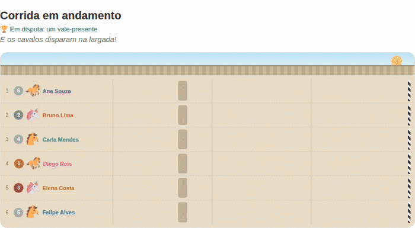
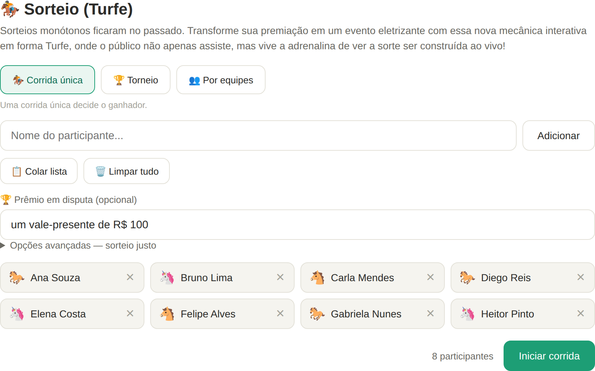
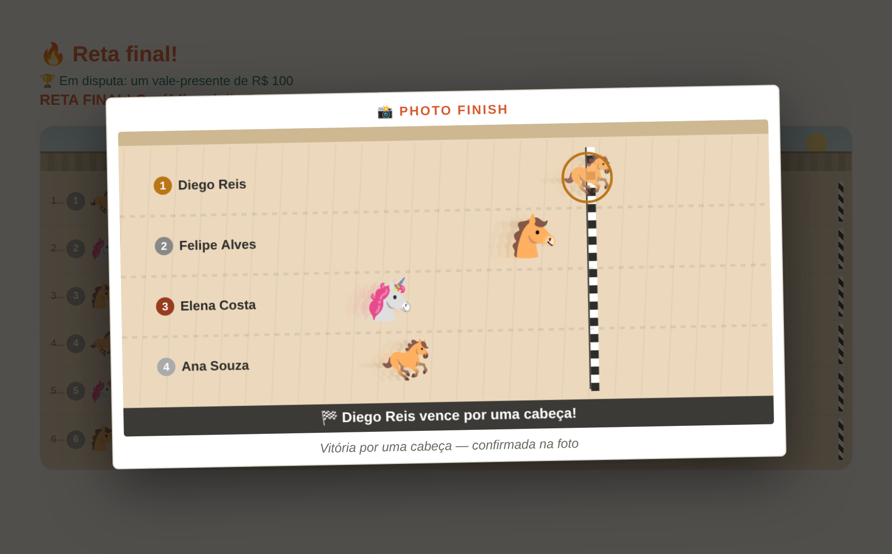
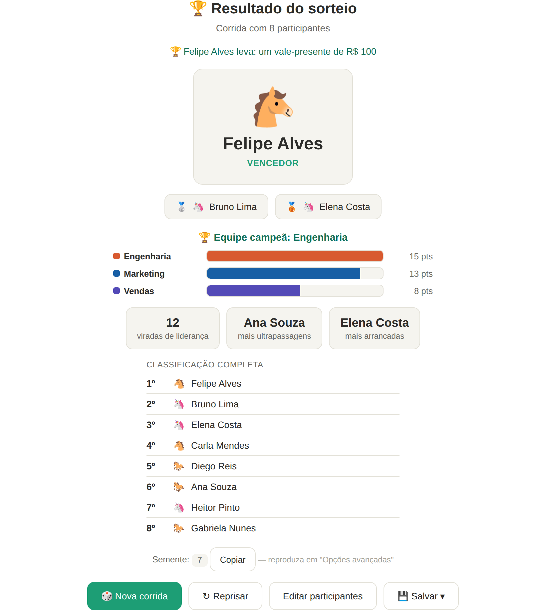
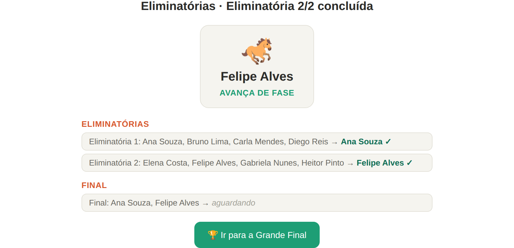

<div align="center">

# 🏇 Sorteio (Turfe)

### Chega de sortear escolhendo "um número" sem graça. Aqui o sorteio vira uma **corrida de cavalos ao vivo** — cada participante é um cavalo e todo mundo torce até a linha de chegada. 🎉

<sub><i>A live, horse-race style raffle for meetings. Paste names, share your screen, and let the crowd cheer.</i></sub>




-BA7517)

</div>

---

## ✨ Por que existe

Em toda reunião no **Teams / Google Meet** alguém precisa sortear alguém — e "tirar um número" é monótono. Com o **Sorteio (Turfe)**, o apresentador **compartilha a tela**, larga a corrida, e os 20 segundos mais sem graça da reunião viram um **momento coletivo**: narração, som de torcida, viradas, e aquela **chegada de tirar o fôlego**. O resultado é sorteado de forma justa — só que **muito mais divertida**.

> Sem instalar nada. Sem cadastro. Sem servidor. É **um único arquivo HTML** — abre no navegador e pronto.

---

## 📦 Você só precisa de **um arquivo**: [`index.html`](index.html)

O aplicativo **inteiro** é o **`index.html`** — e só ele. Baixe esse arquivo, abra no navegador e funciona. Não precisa clonar o repositório, nem instalar nada, nem dos outros arquivos.

Todo o resto aqui é **acessório** (documentação e apresentação) e pode ser ignorado:

| Arquivo / pasta | Para que serve | Precisa para rodar? |
|---|---|---|
| **`index.html`** | **O app completo — HTML + CSS + JavaScript juntos** | ✅ **Sim — é só este** |
| `README.md` | Esta página de apresentação | ❌ Não |
| `docs/` | Imagens usadas no README | ❌ Não |
| `CLAUDE.md` | Notas de arquitetura (para quem for editar o código) | ❌ Não |

> 💡 **Fez `git clone`?** Pode apagar tudo, **menos o `index.html`** — ele continua funcionando exatamente igual. Melhor ainda: nem clone — **baixe só o `index.html`** (botão **Raw** / "Download raw file" na página do arquivo) e abra no navegador.
>
> *(A única coisa que vem "de fora" é a biblioteca jsPDF, carregada da internet apenas no momento de exportar um PDF. O sorteio em si roda 100% offline.)*

---

## 🎬 Veja em ação

**1. Cole os participantes, escolha o modo e o prêmio**



**2. A corrida acontece ao vivo, com narração e torcida** *(veja o GIF animado no topo ⬆️)* — e nas chegadas apertadas, entra o **📸 Photo Finish**:



**3. Revelação com pódio, estatísticas e — no modo equipes — a equipe campeã**



**4. Modo torneio: eliminatórias em chaveamento até a grande final**



---

## 🚀 Recursos

- 🏇 **Três modos de sorteio**
  - **Corrida única** — uma corrida decide o ganhador.
  - **Torneio** — eliminatórias (baterias) cujos vencedores avançam até a grande final.
  - **Por equipes** — além do vencedor individual, calcula a **equipe campeã** por pontos.
- 📣 **Narração ao vivo** + **sons sintetizados** (clarim, tiro de largada, galope, torcida, sino, fanfarra) e **narração por voz** opcional (pt-BR).
- 📸 **Photo finish** — nas chegadas apertadas, congela e mostra a foto da linha de chegada com a margem da vitória ("por um focinho", "por uma cabeça"…).
- ⚖️ **Sorteio justo e reproduzível** — resultado 100% determinístico por **semente**: a mesma semente reproduz exatamente o mesmo sorteio (transparência total).
- 🏆 **Pódio, estatísticas e classificação completa** (viradas de liderança, ultrapassagens, arrancadas).
- 💾 **Exportar** o resultado em **PDF**, **certificado de vitória (PDF)** ou **imagem (PNG)**.
- 👥 **Até 100 participantes**, com **colar lista** (um nome por linha; "Nome, Equipe" no modo equipes).
- 🎉 Confete, fogos e aquela comemoração no final.

---

## ▶️ Como usar

1. **Baixe o `index.html`** e abra no navegador (duplo-clique já funciona).
   Para garantir áudio e narração, prefira servir localmente:
   ```bash
   python3 -m http.server 8000   # depois acesse http://localhost:8000
   ```
2. Escolha o **modo**, **cole a lista** de participantes e (opcional) defina um **prêmio**.
3. No menu **🔊 Som** (canto superior direito), ligue a **🗣️ Narração** por voz se quiser o locutor.
4. **Compartilhe a tela** na reunião, clique em **Iniciar** e deixe a galera torcer! 🏁

> 💡 **Dica de "sorteio justo":** em *Opções avançadas* você pode informar uma **semente**. Anuncie-a antes da corrida (ou peça um número para a plateia) — qualquer pessoa pode reproduzir o mesmo resultado depois. Prova de que não há truque.

---

## 🛠️ Tecnologia

- **Um único arquivo** `index.html` — HTML + CSS + JavaScript, **sem build, sem dependências locais, sem backend**.
- **Vanilla JS**, organizado numa **arquitetura modular** sob o namespace `App` (cada recurso é um módulo de responsabilidade única).
- **Web Audio API** (sons sintetizados, nenhum arquivo de áudio) · **Web Speech API** (narração por voz) · **Canvas** (photo finish e confete).
- Única dependência externa: **[jsPDF](https://github.com/parallax/jsPDF)** via CDN, apenas para exportar PDF.
- **Simulação determinística**: a corrida inteira é pré-calculada a partir da semente (RNG `mulberry32`); a animação só reproduz os quadros já calculados.

Detalhes de arquitetura, módulos, logging e convenções estão em **[`CLAUDE.md`](CLAUDE.md)**.

---

<div align="center">
<sub>Feito para deixar qualquer reunião mais divertida. 🏇 Boa corrida!</sub>
</div>
